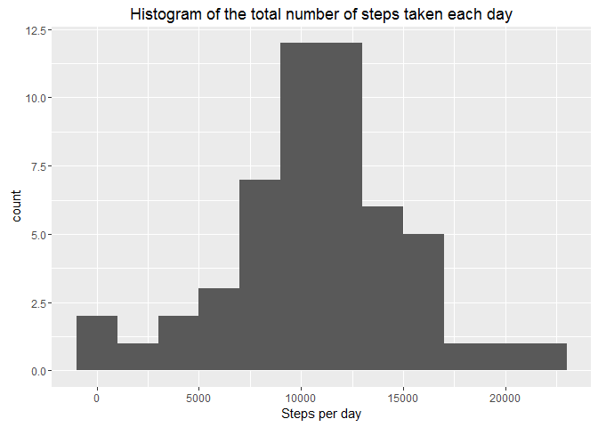
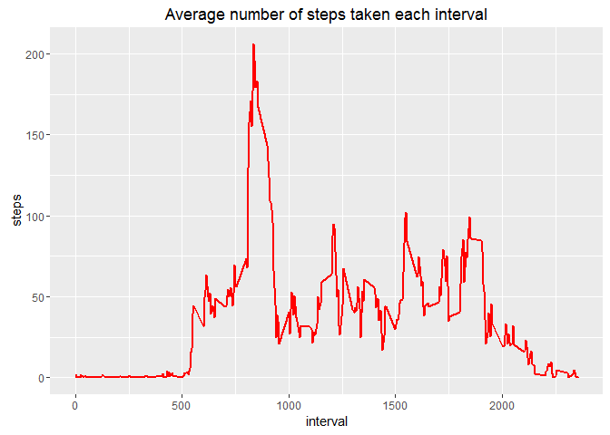
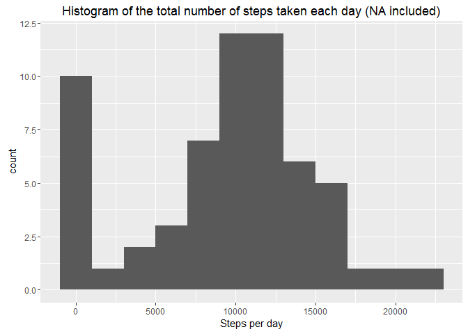
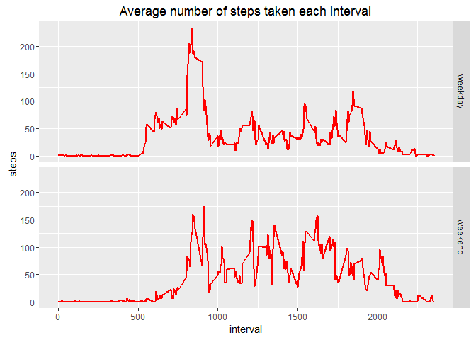

# Reproducible Research: Peer Assessment 1

This assignment makes use of data from a personal activity monitoring device. This device collects data at 5 minute intervals through out the day. The data consists of two months of data from an anonymous individual collected during the months of October and November, 2012 and include the number of steps taken in 5 minute intervals each day.

The variables included in this dataset are:

 - **steps:** Number of steps taking in a 5-minute interval (missing values are coded as NA)
 - **date:** The date on which the measurement was taken in YYYY-MM-DD format
 - **interval:** Identifier for the 5-minute interval in which measurement was taken
The dataset is stored in a comma-separated-value (CSV) file and there are a total of 17,568 observations in this dataset.

\ 
\ 

## Preparing the environment

Loading the packages necessary for the analysis

```r
library(ggplot2)
library(lubridate)
```
\ 
\ 

## Analysis
\ 

### 1. Code for reading in the dataset and/or processing the data

Downloading the data from the web and saves it in the working directory as **Factivity.zip**


```r
fileURL <- "https://d396qusza40orc.cloudfront.net/repdata%2Fdata%2Factivity.zip"
download.file(fileURL, destfile = "Factivity.zip")
```
Unzipping the downloaded data set, reading the information from **activity.csv** file and and assigning it to variable `activity` 

```r
unzip("Factivity.zip")
activity <- read.csv("activity.csv", stringsAsFactors=FALSE)
```
\ 

### 2. Histogram of the total number of steps taken each day

Calculating the the total number of steps taken each day by adding the steps from each period of the same day using aggregate function and assigning the result to the `stepsperday` vriable. This is data.frame with 2 columns, date and steps.

```r
stepsperday <- aggregate(steps ~ date, activity, FUN = sum)
```

Drawing the histogram using **ggplot2** package. I have chosen bindwidth of 2000 wich will count the number of days with steps between 0 and 2000 for the first bind, number of days with steps between 2000 and 4000 for the second bind etc.

```r
ggplot(stepsperday, aes(steps))+
    geom_histogram(binwidth  = 2000)+
    xlab("Steps per day")+
    ggtitle("Histogram of the total number of steps taken each day")
```

<!-- -->

\ 

### 3. Mean and median number of steps taken each day

Calculating mean and median steps taken each day and assigning them to variables `meanstepsperday` and `mdianstepsperday`. Printing the Mean and Median in the console.

```r
meanstepsperday <- mean(stepsperday$steps)
mdianstepsperday <- median(stepsperday$steps)
print(paste0("Mean = ", meanstepsperday, " | Median = ", mdianstepsperday))
```

```
## [1] "Mean = 10766.1886792453 | Median = 10765"
```
\ 

### 4. Time series plot of the average number of steps taken

Calculating the average steps taken for each interval using aggregate function and assigning the result to `stepsperinterval` variable. This is data. frame with 2 columns interval and steps 

```r
stepsperinterval <- aggregate(steps ~ interval, activity, FUN = mean)
```

Drawing the time series plot using **ggplot2** package. 

```r
ggplot(data=stepsperinterval, aes(x=interval, y=steps))+
    geom_line(colour = "red", size = 1)+
    ggtitle("Average number of steps taken each interval")
```

<!-- -->

\ 

### 5. The 5-minute interval that, on average, contains the maximum number of steps

Finding the what is the maximum number of steps on average in the `stepsperinterval` and assign the number to `maxsteps` variable. 
Finding which is the 5 minute interval with maximum steps and asigning the result to `maxstepsinterval` variable.
Printing the results in the console.

```r
maxsteps <- max(stepsperinterval$steps)
maxstepsinterval <- stepsperinterval$interval[which(stepsperinterval$steps == maxsteps)]
print(paste0("The 5 minute interval with maximum steps is: ", maxstepsinterval))
```

```
## [1] "The 5 minute interval with maximum steps is: 835"
```
\ 

### 6. Code to describe and show a strategy for imputing missing data

The aggregate function used in my calculations is ignoring NA variables and is not taking them in account for the calculations.
To include NA values in the calculations the argument `na.action` shluld be set to `na.pass`.
**ggplot2** is ignoring the NA values as well. I couldn`t find option to includ the NA values in the calculations.

\ 

### 7. Histogram of the total number of steps taken each day after missing values are imputed

As the calculations made earlear are not including the NA values here I will recalculate the variables by including NA variables and assign the result to `stepsperdayNA` variable.

```r
stepsperdayNA <- aggregate(steps ~ date, activity, FUN = sum, na.action = na.pass)
```

As i couldn`t find option in **ggplot2** to include NA values I will first srt all the NA values to 0 and then draw the histogram.


```r
stepsperdayNA[is.na(stepsperdayNA$steps),2]=0
ggplot(stepsperdayNA, aes(steps))+
    geom_histogram(binwidth  = 2000)+
    xlab("Steps per day")+
    ggtitle("Histogram of the total number of steps taken each day (NA included)")
```

<!-- -->

Calculating the mean and median from the data including NA. and printing the results from both with and without NA values

```r
meanstepsperdayNA <- mean(stepsperdayNA$steps)
mdianstepsperdayNA <- median(stepsperdayNA$steps)
print(paste0("Mean = ", meanstepsperday, " | Median = ", mdianstepsperday))
```

```
## [1] "Mean = 10766.1886792453 | Median = 10765"
```

```r
print(paste0("MeanNA = ", meanstepsperdayNA, " | MedianNA = ", mdianstepsperdayNA))
```

```
## [1] "MeanNA = 9354.22950819672 | MedianNA = 10395"
```
\ 

### 8. Panel plot comparing the average number of steps taken per 5-minute interval across weekdays and weekends

Using **lubridate** package converting the dates in `activity` data.frame from character to datatime format. 
Making new column wday in the `activity` data.frame with dates of the week coresponding to every date from date column.
Making new column we which will hold information weather the day was weekday or weekend, assigning "weekday" to all of them and if the wday column contains "Sun" or "Sat" asigning "weekend".
Using aggregate function calculating average steps per every interval for the weekend and week days. The result is assignet to weekdata variable, this is data.frame with 3 columns interval, we (weekend or weekday) and steps (average number of steps).

```r
activity$date <- ymd(activity$date)
activity$wday <- wday(activity$date, label = T)
activity$we <- "weekday"
activity[activity$wday %in% c("Sun", "Sat"),5] <- "weekend"
weekdata <- aggregate(steps~interval + we, activity, FUN = mean)
```

Drawing the time series plot for week day and for the weekend day using **ggplot2** package. 

```r
ggplot(data=weekdata, aes(x=interval, y=steps))+
    geom_line(colour = "red", size = 1)+
    facet_grid(we~.)+
    ggtitle("Average number of steps taken each interval")
```

<!-- -->

\ 
\ 
 
